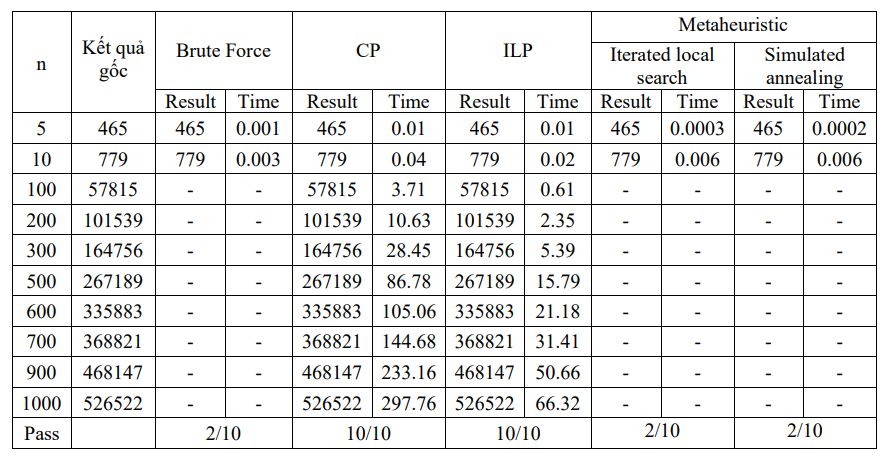

# TSP with Time Windows

## Giới thiệu

TSPTW là bài toán tìm đường đi 
có chi phí tối thiểu đi qua từng thành phố trong tập hợp các thành phố, mỗi thành phố đi qua chính xác một lần, với điều kiện mỗi thành phố phải được thăm trong một khoảng thời gian nhất định. TSPTW đã nhận được sự chú ý đáng kể, trong nhiều năm, vì nó là cốt lõi của nhiều ứng dụng lập lịch và định tuyến quan trọng trong đời thực

## Phương pháp giải
Trình bày 5 phương pháp giải khác nhau:
* Nhánh cận
* Quy hoạch ràng buộc (Constraint Programming)
* ILP
* Tham lam (Greedy)
* Heuristic

## Hướng dẫn chạy code
Cài đặt các thư viện cần thiết:\
`pip install -r requirement`

Các thư mục:
* Thư mục `testcase` chứa các bộ test trên Open ERP

* Thư mục `output` chứa các kết quả của từng phương pháp

Chạy từng phương pháp ở các file trong folder `./src`

## Kết quả

## Nhận xét
* **Brute Force**: rất dễ để cài đặt nhưng thời gian chạy khá chậm, với bộ dữ liệu nhiều đỉnh thì thời gian chạy sẽ vô cùng lớn

* **CP** : Cách mô hình bài toán dễ hiểu, áp dụng được vào được các công cụ giải bài toán tối ưu ràng buộc. Vượt qua hết các test case với thời gian nhanh, với N = 1000 thời gian chạy gần 5 phút, khả thi với bài toán lập lịch trong thực tế

* **ILP** : chạy rất nhanh, tuy nhiên phần định nghĩa mô hình hóa bài toán khá là khó. Đối với những bộ test có nhiều lời giải thỏa mãn điều kiện, ILP tính toán rất chậm

* **Greedy**: Các thuật toán greedy thường đơn giản có thời gian tính toán thấp không đáng kể. Tuy nhiên chỉ cho đáp án khi giả định ban đầu là đúng. Cần tiếp tục tìm phương án cải tiến và đưa ra chiến lược bao quát hơn

* **Heuristic**: Thời gian chạy là trong khoảng chấp nhận được khi thử trên bộ dữ liệu bé hơn 20. Cần cải thiện phương thức khởi tạo thay vì vét cạn và tăng cường thêm các thuật toán metaheuristic khác: Guided local search, Tabu search, Variable neighborhood search